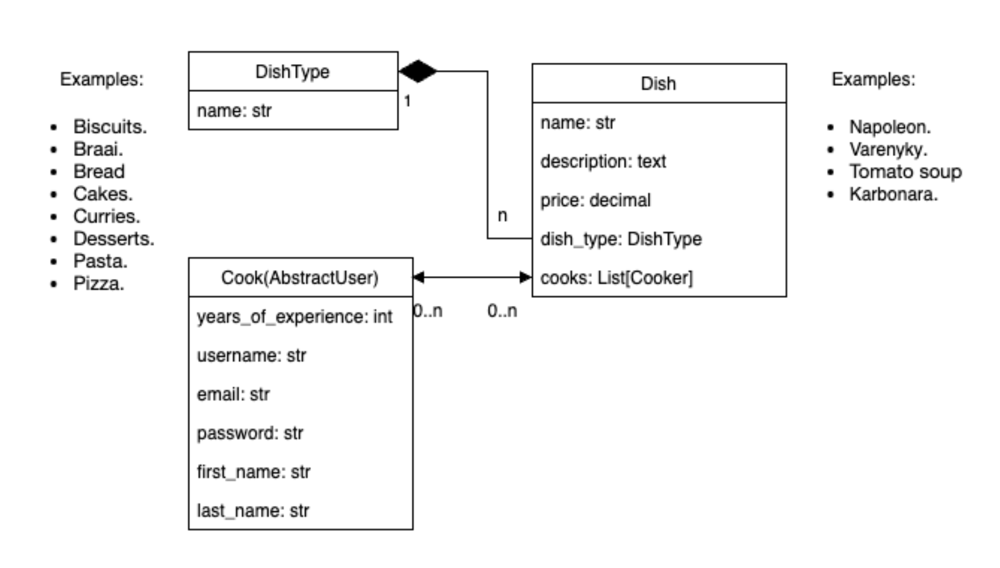
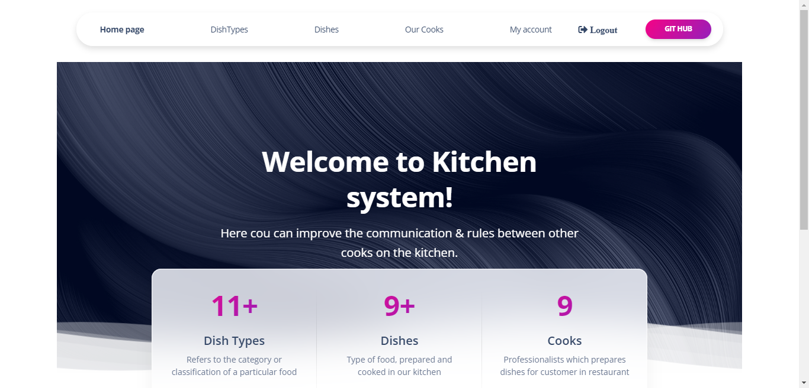
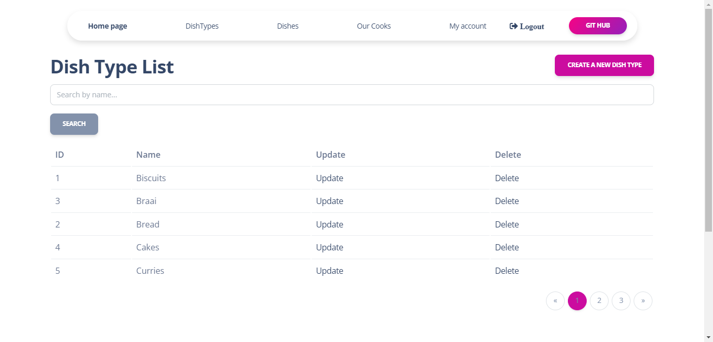
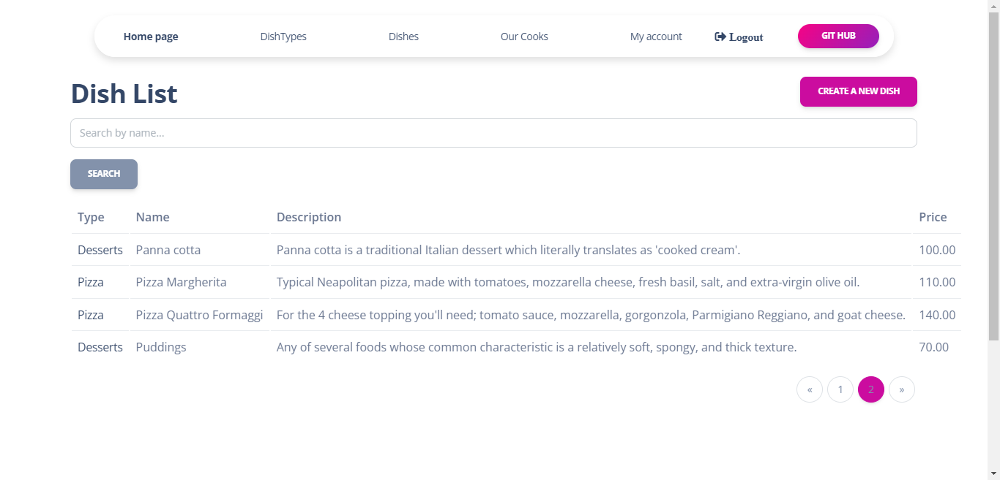

# Restaurant project
Imagine you are the owner of restaurant, and you want to improve the communication & rules between your cooks on the kitchen.
Project has next structure:



## Check it out!
Restaurant project deployed to Render
https://restaurant-service-2gjn.onrender.com

## Installation:

1. Fork the repo (GitHub repository)
2. Clone the forked repo 

```
git clone the-link-from-your-forked-repo
```

3. Open the project folder in your IDE
4. Open a terminal in the project folder
5. Create a branch for the solution and switch on it

```
   git checkout -b develop
```

6. If you are using PyCharm - it may propose you to automatically create venv for your project and install requirements in it, but if not:

```
python -m venv venv
venv\Scripts\activate (on Windows)
source venv/bin/activate (on macOS)
pip install -r requirements.txt
```

7. Set Up Database:

```angular2html
python manage.py makemigrations
python manage.py migrate
```

8. Start the app:

```
python manage.py runserver
```
At this point, the app runs at http://127.0.0.1:8000/.


## Testing project:


Than you can sigh in and test a project with data:

Login: Tom

Password: dfghj123

After login you will see Home Page

 In the top you can choose Dish Types, Dishes, Cooks or My Account.
In these pages you can add new cooks, dishes or dish types, delete them, searching in bd, go to the next pages using pagination, update info, connect you to some especially dish or delete from exact dish.

I'll also add below here a few screenshots for better navigation on site.






